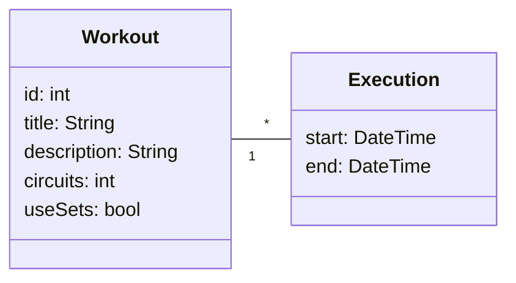

# casui

Utilities for calisthenics training

## Models

```mermaid
classDiagram
direction LR
    class Workout {
        id: int
        title: String
        description: String
        circuits: int
        useSets: bool
    }

    Workout "1" -- "*" Execution

    class Execution {
        start: DateTime
        end: DateTime
    }
```