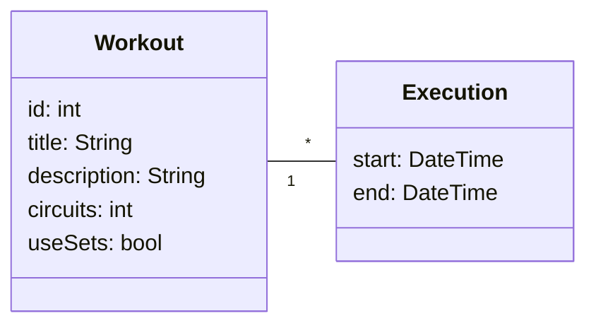

# casui

FOSS workout app focused on calisthenics enthusiasts.

## How to run

If on linux:

    apt install sqlite3 libsqlite3-dev

If on Windows, i presume you would install SQLite3 normally.

## Models

